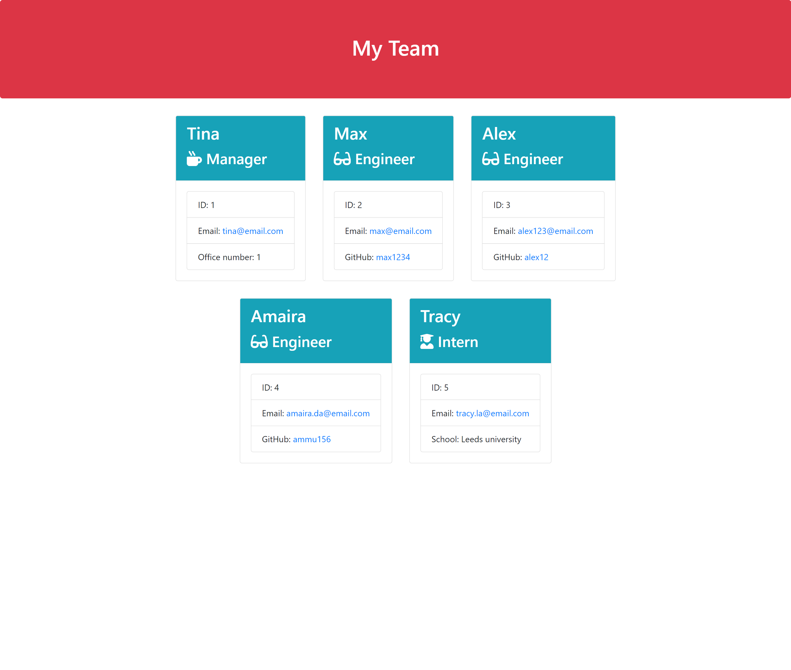

# Team Profile Generator
  
  

  ## Table of Contents:
  - [Description](#description)
  - [Installation](#installation)
  - [Usage](#usage)
  - [Contributing](#contributing)
  - [Tests](#tests)
  - [License](#license)
  - [Questions](#questions)

  ## Description
  This application will take in information about employees on a software engineering team, then generates an HTML webpage that displays summaries for each person.

  ## Installation
  To Run this Application you will need to install Node.js, Inquirer Package and Jest Package.

  ## Usage
  As a manager a user want to generate a webpage that displays my team's basic info so that a user have quick access to their emails and GitHub profiles.
  
  ### Mock-Up
  

  ## Contributing
  All contributions are welcome.

  ## Tests
  

  ## License
  This Application is covered under MIT License.

  ## Questions
  * Here is my GitHub Link : [My GitHub](vinita686)

  * If you have some additional questions you can reach me at : yadav.vinita@gmail.com 
